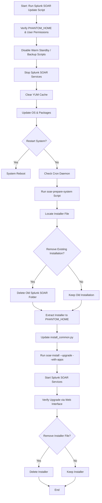

# Splunk SOAR Update Script for Red Hat 

[](https://www.gnu.org/software/bash/)


> **Last update:** 30/01/2024
> **Source:** [Splunk SOAR On-Premises Upgrade Docs](https://docs.splunk.com/Documentation/SOARonprem/6.3.1/Install/PrepareSystemForUpgrading)

---

## Table of Contents

1. [Overview](#overview)
2. [Features](#features)
3. [Prerequisites](#prerequisites)
4. [Usage Instructions](#usage-instructions)
5. [Script Action Summary](#script-action-summary)
6. [Safety Notes](#safety-notes)
7. [References](#references)
8. [License](#license)

---

## Overview

This Bash script automates the **preparation and upgrade of Splunk SOAR (On-Premises)** on Red Hat systems. It provides:

* System checks and preparation
* Optional OS updates and patching
* Service management (stop/start)
* Installer extraction and upgrade execution
* Safe prompts for each critical action

It is ideal for administrators performing maintenance on Splunk SOAR environments.

---

## Features

* Step-by-step upgrade prompts
* OS verification (`rpm -q redhat-release`)
* PHANTOM\_HOME validation
* YUM cache cleaning and OS package updates
* Service stop/start automation (`stop_phantom.sh` / `start_phantom.sh`)
* Cron daemon validation
* SOAR installer extraction and upgrade
* Automatic update of critical files (`install_common.py`)

---

## Prerequisites

1. **User & Permissions**

   * Ensure a `phantom` user exists and owns the SOAR installation folder.

2. **Installation Path**

   * Default: `/opt/phantom/`
   * Custom paths can be provided when prompted.

3. **Installer File**

   * Must match pattern: `splunk_soar-unpriv-*-x86_64.tgz`
   * Place it in the script’s directory before execution.

4. **System Requirements**

   * Red Hat Enterprise Linux (or compatible)
   * Sudo privileges

---

## Usage Instructions

```bash
# Clone repository
git clone https://github.com/N0rdicSec/soar.git
cd soar

# Rename the script for easy usage. Make the script executable
chmod +x "Splunk SOAR Update.sh"

# Run the script
sudo ./Splunk\ SOAR\ Update.sh
```

* Follow all interactive prompts.
* Each step can be skipped if already completed or unnecessary.

---

## Script Action Summary

1. **Log in as the `phantom` user**
   Ensure the correct user owns the installation folder.

2. **Disable warm standby or automated backups**
   Stop `ibackup.pyc` cron jobs or warm standby features if used.

3. **Stop all Splunk SOAR services**

```bash
sudo $PHANTOM_HOME/bin/stop_phantom.sh
```

4. **Clear YUM caches**

```bash
sudo yum clean all
```

5. **Update OS packages**

```bash
sudo yum update -y
```

6. **Restart system** (optional)

```bash
sudo reboot
```

7. **Check cron daemon**

```bash
pgrep -x crond || sudo systemctl start crond.service
```

8. **Run `soar-prepare-system` script**

```bash
sudo ./soar-prepare-system
```

9. **Installer extraction and upgrade**

```bash
tar -xvf splunk_soar-unpriv-*-x86_64.tgz -C "$PHANTOM_HOME"
cd "$PHANTOM_HOME/splunk-soar"
./soar-install --upgrade --with-apps
```

10. **Update `install_common.py`**
    Replace `mirror` URLs with `vault` in the installer folder.

11. **Verify upgrade**
    Log in to the web interface to confirm.

12. **Optional**: Remove installer file

```bash
rm -f splunk_soar-unpriv-*-x86_64.tgz
```

---

## Safety Notes

* **Always back up your SOAR environment** before starting.
* Stop all SOAR services before extraction.
* Perform OS updates and reboots in a maintenance window.
* Confirm warm standby/backup scripts are disabled.

---

## References

* [Splunk SOAR On-Premises Upgrade Documentation](https://docs.splunk.com/Documentation/SOARonprem/6.3.1/Install/PrepareSystemForUpgrading)

---

## License

This project is licensed under the **MIT License**. See the `LICENSE` file for details.

---

## Upgrade Workflow



**Legend:**

* Rectangles = Action steps
* Diamonds = Decision points / prompts
* Flow is top-down, showing sequential script steps

